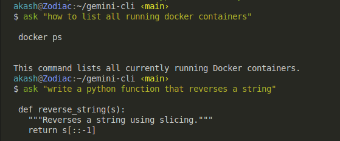

# gmnx

<!-- Badges -->
<p>
  <a href="https://github.com/int-arsh/gmnx/actions">
    
  </a>
  <a href="https://hub.docker.com/r/akashdocker303/gmnx">
    
  </a>
  <a href="https://hub.docker.com/r/akashdocker303/gmnx">
    
  </a>
  <a href="#license">
    
  </a>
</p>

> A powerful, colorful, and easy-to-use command-line assistant powered by Google Gemini API. Get instant help with commands, code snippets, and explanations directly in your terminal.

## ✨ Features

- 🚀 **Zero Setup**: Pull a Docker image and run - no Python installation required
- 🎨 **Beautiful Output**: Rich Markdown formatting with syntax highlighting
- 🔒 **Secure**: API keys passed at runtime, never baked into images
- 🐳 **Containerized**: Consistent experience across all platforms
- ⚡ **Fast**: Optimized for command-line workflows
- 🧪 **Well Tested**: Comprehensive test suite with CI/CD integration

## ⚡ Quickstart

### Docker (Recommended)

```bash
# Pull and run
docker run --rm -e GEMINI_API_KEY="$GEMINI_API_KEY" akashdocker303/gmnx:latest "explain Docker vs Kubernetes"

# Add persistent alias
echo 'alias ask="docker run --rm -e GEMINI_API_KEY=\"$GEMINI_API_KEY\" akashdocker303/gmnx:latest"' >> ~/.zshrc
source ~/.zshrc

# Use it
ask "how to find all files larger than 100MB"
```

### Local Development

```bash
# Clone and setup
git clone https://github.com/int-arsh/gmnx.git
cd gmnx
python3 -m venv .venv
source .venv/bin/activate
pip install -r requirements.txt

# Run
export GEMINI_API_KEY="your-api-key"
python ask.py "hello world"
```

## 🎥 Demo



*Terminal recording showing gmnx in action*

## 📋 Prerequisites

- **Docker** (for containerized usage) or **Python 3.12+** (for local development)
- **Google Gemini API Key** - Get one from [Google AI Studio](https://aistudio.google.com/app/apikey)

## 🛠️ Development

### Project Structure

```
gmnx/
├── ask.py                 # Main CLI application
├── Dockerfile            # Container definition
├── requirements.txt      # Python dependencies
├── tests/               # Test suite
│   ├── test_ask.py      # Unit tests
│   └── test_docker.py   # Integration tests
├── .github/workflows/   # CI/CD pipeline
└── docs/               # Documentation
```

### Running Tests

```bash
# Install dependencies
make install-deps

# Run all tests
make test

# Run with coverage
make test-coverage

# Quick unit tests only
make test-unit
```

### Building Docker Image

```bash
# Build locally
make build

# Run tests
make test-docker
```

## 🚀 CI/CD Pipeline

This project uses GitHub Actions for automated testing and deployment:

- **On every push to `main`**: Runs tests and builds Docker image
- **On git tags**: Creates versioned releases
- **Automated Docker Hub publishing**: Images pushed automatically

### Pipeline Stages

1. **Test** - Unit tests and Docker integration tests
2. **Build** - Multi-arch Docker image creation
3. **Push** - Automatic publishing to Docker Hub

## 🐳 Docker Details

### Why Docker?

- **Consistency**: Same environment everywhere
- **Isolation**: No conflicts with local Python setup
- **Distribution**: Easy sharing and deployment
- **Security**: API keys at runtime, not in images

### Image Variants

- `akashdocker303/gmnx:latest` - Latest stable version
- `akashdocker303/gmnx:v1.0.0` - Pinned version releases

### Advanced Usage

```bash
# Mount current directory for file operations
docker run --rm -e GEMINI_API_KEY="$GEMINI_API_KEY" \
  -v "$PWD":/work -w /work \
  akashdocker303/gmnx:latest "analyze this code"

# Use specific version
docker run --rm -e GEMINI_API_KEY="$GEMINI_API_KEY" \
  akashdocker303/gmnx:v1.0.0 "help me debug this"
```

## 🧪 Testing Strategy

### Test Coverage

- **Unit Tests**: CLI logic, error handling, API mocking
- **Integration Tests**: Docker container functionality
- **CI/CD Tests**: Automated testing on every commit

### Test Commands

```bash
# All tests
make test

# Unit tests only
make test-unit

# Docker tests only
make test-docker

# Coverage report
make test-coverage
```

## 📚 Usage Examples

### Command Line Help

```bash
ask "how to list all running Docker containers"
ask "explain the difference between soft and hard links"
ask "write a Python function to reverse a string"
ask "debug this error: ModuleNotFoundError"
```

### Programming Questions

```bash
ask "show me a React component with hooks"
ask "how to implement binary search in Python"
ask "explain Docker networking concepts"
```

### System Administration

```bash
ask "how to monitor disk usage on Linux"
ask "set up a reverse proxy with nginx"
ask "troubleshoot slow database queries"
```

## 🔧 Configuration

### Environment Variables

- `GEMINI_API_KEY` - Required. Your Google Gemini API key

### Shell Integration

Add to your `~/.zshrc` or `~/.bashrc`:

```bash
# Docker version (recommended)
alias ask='docker run --rm -e GEMINI_API_KEY="$GEMINI_API_KEY" akashdocker303/gmnx:latest'

# Local version
alias ask='python3 /path/to/gmnx/ask.py'
```

## 🤝 Contributing

We welcome contributions! Please see [CONTRIBUTING.md](CONTRIBUTING.md) for details.

### Development Workflow

1. Fork the repository
2. Create a feature branch
3. Make your changes
4. Add tests
5. Submit a pull request

## 📄 License

This project is licensed under the MIT License - see the [LICENSE](LICENSE) file for details.

## 🔒 Security

Security vulnerabilities should be reported privately. See [SECURITY.md](SECURITY.md) for details.

## 📖 Additional Resources

- [Google Gemini API Documentation](https://ai.google.dev/gemini-api/docs)
- [Docker Documentation](https://docs.docker.com/)
- [Python Testing Guide](https://docs.python.org/3/library/unittest.html)

---

**Made with ❤️ for the DevOps community**